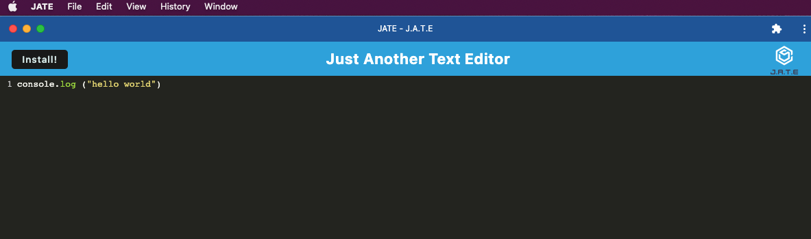

# PWA-text-edit

  

## Table of Contents
  
* [Description](#description)
* [Screenshot](#screenshot)
* [Link](#link)
* [License](#license)

## Description
  This is a progressive web application text editor. It can be installed and used offline. It functions similarly to other text editors.

## Screenshot

## Link 

To try out this application click [here](https://whispering-bastion-70222.herokuapp.com/)
  
## Contributing
  Thank you to University of Arizona Bootcamp for providing this challenge.
  
## License
  MIT license. Click the license badge at the top for license details.

